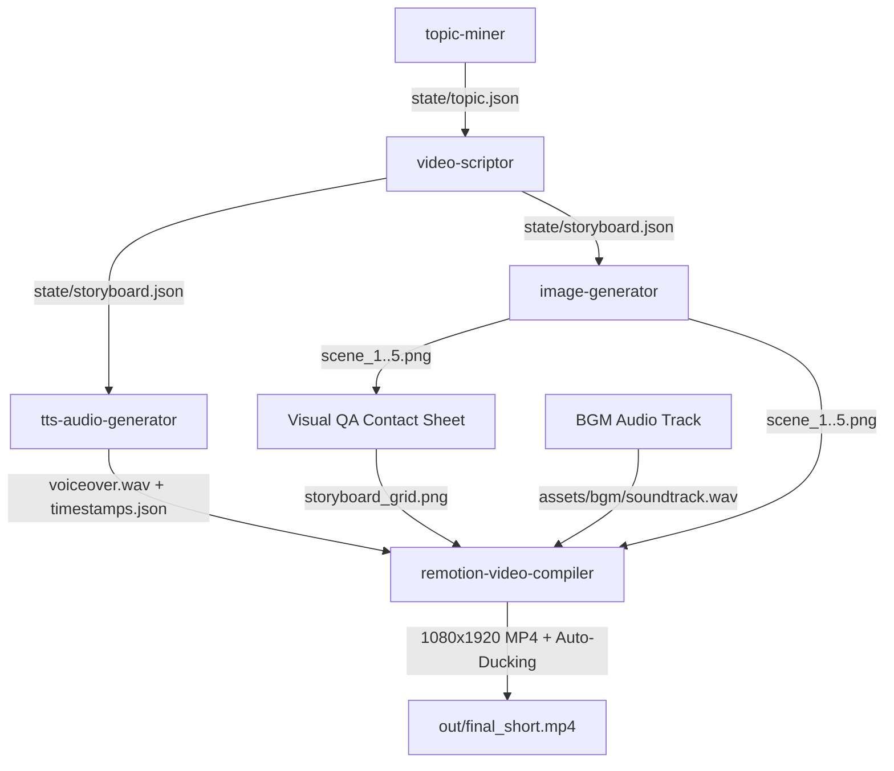

# End-to-End Tactical History Short-Form Video Generation Workflow

This workflow orchestrates the automated production of high-retention 9:16 vertical video shorts on **Tactical History & Ancient Warfare** using local and open-source tools.

---

## Pipeline Execution Order



---

## Execution Stages

### Step 1: Topic Mining
Query and select a high-impact tactical anomaly, forgotten siege engine, or bizarre military invention.
```bash
python .agent/skills/topic-miner/scripts/mine_topics.py \
  --category all \
  --output state/topic.json
```
*Output*: `state/topic.json`

### Step 2: Storyboarding & Scripting
Transform topic into a 5-scene vertical storyboard (~130 words, 45 seconds total duration). Enforce visual prompt suffixes:
`--ar 9:16, dark atmospheric oil painting, volumetric lighting, high fidelity`.
```bash
python .agent/skills/video-scriptor/scripts/generate_storyboard.py \
  --topic state/topic.json \
  --output state/storyboard.json
```
*Output*: `state/storyboard.json`

### Step 3: Voiceover Synthesis & Timestamp Alignment
Synthesize high-fidelity voiceover using Kokoro-82M (or local TTS) and calculate word-level aligned timestamps for kinetic text sync.
```bash
python .agent/skills/tts-audio-generator/scripts/synthesize.py \
  --storyboard state/storyboard.json \
  --output-audio assets/audio/voiceover.wav \
  --output-timestamps assets/audio/timestamps.json \
  --voice am_adam \
  --speed 1.05
```
*Outputs*: `assets/audio/voiceover.wav`, `assets/audio/timestamps.json`

### Step 4: Visual Frame Generation
Generate 9:16 vertical keyframe images for each scene via ComfyUI REST API or local artistic rendering.
```bash
python .agent/skills/image-generator/scripts/generate_frames.py \
  --storyboard state/storyboard.json \
  --output-dir assets/frames \
  --backend auto \
  --width 1080 \
  --height 1920
```
*Outputs*: `assets/frames/scene_1.png` ... `assets/frames/scene_5.png`

### Step 5: Visual QA Contact Sheet Generation
Generate a unified contact sheet thumbnail grid to rapidly audit visual consistency, shot composition, and camera motion metadata before compilation.
```bash
python .agent/skills/image-generator/scripts/create_contact_sheet.py \
  --frames-dir assets/frames \
  --storyboard state/storyboard.json \
  --output assets/frames/storyboard_grid.png \
  --cols 5
```
*Output*: `assets/frames/storyboard_grid.png`

### Step 6: Final Short-Form Video Compilation
Assemble the video with smooth Ken Burns motion zooms, synchronized scene cuts, and auto-ducked background music (-22 dB under dialogue, -12 dB during pauses).
```bash
bash .agent/skills/remotion-video-compiler/scripts/render_short.sh \
  --storyboard state/storyboard.json \
  --audio assets/audio/voiceover.wav \
  --timestamps assets/audio/timestamps.json \
  --frames-dir assets/frames \
  --bgm assets/bgm/soundtrack.wav \
  --output out/final_short.mp4
```
*Alternative cross-platform command (PowerShell / Windows CMD)*:
```powershell
python .agent/skills/remotion-video-compiler/scripts/render_short.py --storyboard state/storyboard.json --output out/final_short.mp4
```
*Output*: `out/final_short.mp4`

---

## Quality Gate Checklist

Before publishing, verify:
- [ ] **0-3s Hook**: Does Scene 1 feature a striking visual and immediate voiceover paradox?
- [ ] **Pacing & Duration**: Is the total duration between 42 and 48 seconds?
- [ ] **Visual Consistency**: Are all 5 frames rendered in vertical 9:16 aspect ratio with the dark atmospheric oil painting style?
- [ ] **Dialogue Clarity**: Does background music compress cleanly to -22 dB beneath speech, swelling to -12 dB during transitions?
- [ ] **Loop Hook**: Does the ending sentence in Scene 5 cycle seamlessly back into Scene 1?
